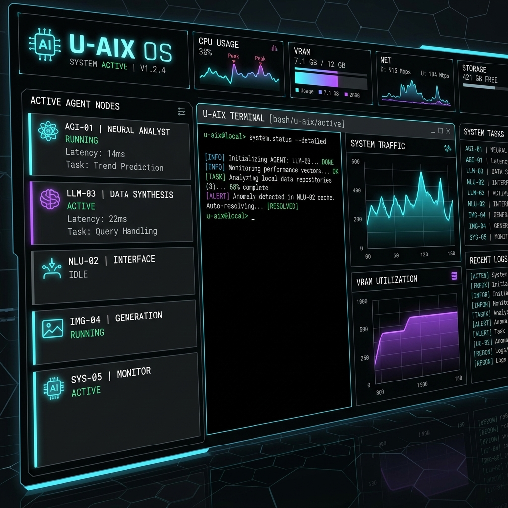
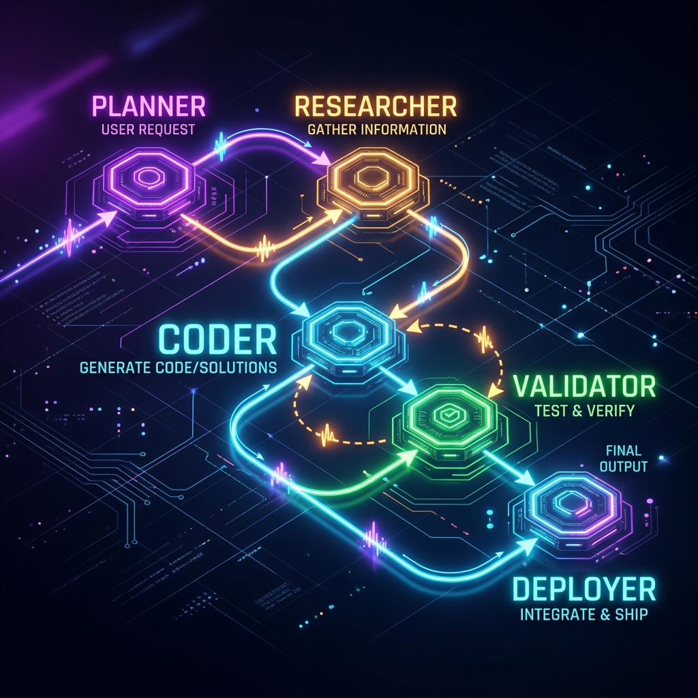
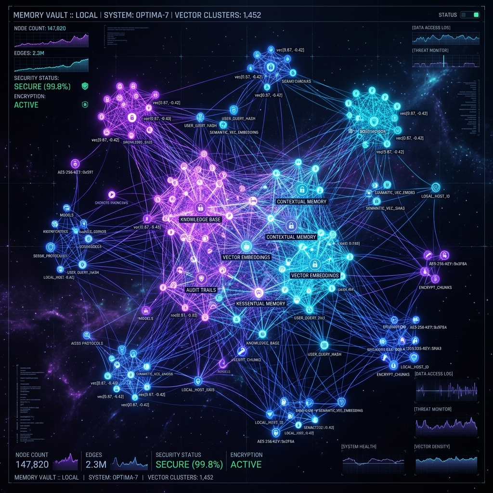

# U-AIX OS: Universal Agentic AI Operating System

U-AIX OS is a local-first, free, and open-source **AI Operating System, Agent Marketplace, and Universal Skill Runtime**. 

It turns any local hardware (CPU/GPU) into an active agent orchestrator, standardizes capabilities into installable skill packages, and maintains user sovereignty using an offline-first encrypted vector memory vault.



---

## Key Pillars
- **Every AI becomes a compute layer** (Priority on FOSS models via Ollama/Llama.cpp).
- **Every prompt becomes executable logic** (Planner nodes decompose intent to DAGs).
- **Every skill becomes installable software** (Open-source JSON/YAML skill manifests).
- **Every user becomes a builder** (Interactive Workspace Shell with no signup/API fees).

---

## Visual Simulator Dashboard Features

The dashboard provides a high-fidelity visual simulator environment built to demonstrate U-AIX OS specifications in action:

1. **Workspace Shell:** Monospace intent shell parsing natural language queries into local execution loops.
2. **Registry Marketplace:** Search and install secure, sandboxed agent configurations and plugins.
3. **Skill Builder Compiler:** Code editor and safety compiler scanning ASTs for eval vulnerabilities.
4. **Autonomous DAG Orchestrator:** Compile multi-agent missions into Directed Acyclic Graphs (DAGs). Features a step-by-step animated execution flow, inter-agent IPC message logs, live resource telemetry, and a simulated **Human-in-the-Loop** consent prompt.
   
5. **Memory Vault Graph Network:** 2D canvas force-directed graph to inspect semantic tokens and link custom knowledge nodes.
   
6. **Router Telemetry Config:** Connect to a local Ollama node and view active telemetry charts.
7. **Documentation Hub:** Unified markdown viewer containing full system architecture guides.

---

## Getting Started

### 1. Run the Visual Simulator Dashboard
The repository contains a fully interactive web visualizer simulator detailing the agent runtime execution logs, marketplace installers, memory vaults, and multi-model routing metrics.

To open the dashboard:
- Simply open the [index.html](index.html) file directly in any modern web browser.
- Or launch using a local static file server:
  ```bash
  npx http-server ./
  ```
  Then open `http://localhost:8080`.

### 2. Connect a Local AI Node (Optional)
If you have **Ollama** running locally, the web visualizer can automatically establish a connection:
1. Ensure Ollama is running on your machine (`http://localhost:11434`).
2. Set your model target in the **Router Settings** tab (e.g. `llama3` or `qwen2.5-coder`).
3. Press **Connect & Verify Link**.
4. Submit intents inside the Workspace shell—they will be routed to your local GPU/CPU model in real-time, executing locally at zero cost!

---

## Repository Documentation Index
The `/docs` directory contains detailed files for all 14 required specifications:

1. [Full Architecture Design](docs/1_architecture.md)
2. [UI Screens & UX Layout Map](docs/2_ui_screens.md)
3. [Database Design & SQL Schemas](docs/3_database_design.md)
4. [REST & WebSocket API Specs](docs/4_apis.md)
5. [Developer SDK Structure (Python/TS)](docs/5_sdk_structure.md)
6. [Marketplace Logic & Validation ASTs](docs/6_marketplace_logic.md)
7. [Agent State Lifecycle Machine](docs/7_agent_lifecycle.md)
8. [Docker Compose & Kubernetes Deployments](docs/8_deployment.md)
9. [Cost Estimates Comparison](docs/9_cost_estimates.md)
10. [Open Source Growth Strategy Flywheel](docs/10_growth_strategy.md)
11. [Investor Presentation Outline](docs/11_investor_deck.md)
12. [Technical Documents (Memory Sync / Scoring)](docs/12_technical_documents.md)
13. [Competitive Positioning Analysis](docs/13_competitive_positioning.md)
14. [Global GTM Launch Roadmap](docs/14_global_launch_plan.md)

---

## License
MIT — 100% Free, Open-Source, and Sovereign (see [LICENSE](LICENSE)).
