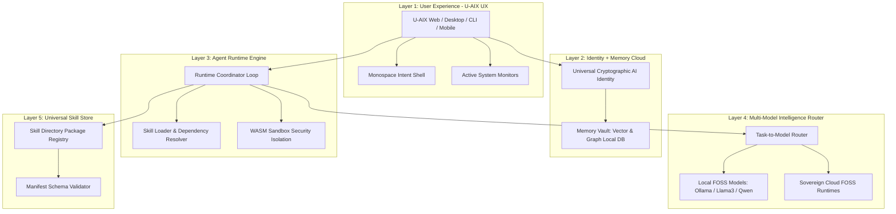

# U-AIX OS Architecture Specification

This document details the complete 5-layer system architecture of the **Universal AI Operating System (U-AIX OS)**. U-AIX OS is a FOSS, local-first computing layer designed to coordinate specialized multi-agent networks, protect user privacy, and run offline on commodity hardware.



---

## 1. System Layer Specifications

### Layer 1: User Experience (UX)
U-AIX OS provides a visual environment designed for natural language control:
- **Intent Shell**: A unified monospace input bar. Natural language triggers (e.g. "Scrape site data and compile reports") are parsed into structural workflows.
- **Active Monitors Panel**: Real-time telemetry monitoring active thread status, memory key queries, CPU loads, and VRAM utilization.
- **Skill Installer Hub**: Graphical interfaces to toggle, check permission parameters, and inspect security manifests of installed modules.

### Layer 2: Identity + Memory Cloud (Local-First)
To enforce complete user sovereignty, all operational context remains encrypted on-device:
- **Universal Cryptographic AI Identity**: Anchored on local hardware security enclaves (TPM/Keychain). It signs all local action tasks and data transactions.
- **Memory Vault**: Combines vector indexing and relational structures:
  - **Short-Term Memory**: In-memory execution scopes for ongoing transaction graphs.
  - **Long-Term Memory**: Structured SQLite tables mapped to an ONNX runtime embedding vector index and an adjacency list graph schema.
  - **Context Syncer**: Migrates session logs into database nodes upon workflow completions.

### Layer 3: Agent Runtime Engine
The orchestration loop of U-AIX OS:
- **State Coordinator**: Manages state transitions: `Created` -> `Planning` -> `Executing` -> `Suspended` -> `Validating` -> `Completed` / `Failed`.
- **WASM Sandbox**: Executes third-party skills inside isolated WebAssembly spaces, blocking raw file or network access unless explicitly granted.
- **Inter-Agent Communication (IPC)**: Pub/Sub event loops passing JSON messages between active agent processes.

### Layer 4: Multi-Model Intelligence Router
Allocates model capacity based on resource cost, latency, and confidentiality rules:
- **Local Priority**: Routes tasks directly to local Ollama endpoints (`http://localhost:11434`) running FOSS models.
- **Dynamic Decision Score**: A decision scorecard evaluating complexity, privacy restrictions, real-time requirements, and compute budgets.

### Layer 5: Universal Skill Store
A packaging system standardizing agent tools:
- **Open Skill Manifest**: JSON configurations declaring versioning, dependency hierarchies, inputs, outputs, and permission sets.
- **AST Safety Analyzer**: Scans code trees for forbidden eval triggers and namespace leaks during compilation.

---

## 2. IPC Message Protocol Payloads

Agents exchange context payloads over localized IPC loops:

### Task Decomposed DAG Broadcast
```json
{
  "event": "dag_created",
  "execution_id": "exec_40912ae-330f",
  "steps": [
    { "step_id": "s-1", "agent": "research_agent", "action": "query_memories", "status": "pending" },
    { "step_id": "s-2", "agent": "coder_agent", "action": "generate_script", "status": "pending" }
  ],
  "constraints": {
    "network_allowed": true,
    "max_runtime_ms": 10000
  }
}
```

### Agent State Transition Frame
```json
{
  "event": "state_changed",
  "execution_id": "exec_40912ae-330f",
  "agent_id": "coder_agent",
  "from_state": "Planning",
  "to_state": "Executing",
  "timestamp": "2026-06-23T08:12:00.412Z"
}
```

### Human Authorization Prompt (Suspended State)
```json
{
  "event": "auth_required",
  "execution_id": "exec_40912ae-330f",
  "step_id": "s-2",
  "permission": "file_system.write",
  "target": "./output/report.csv",
  "prompt_text": "Confirm execution of file system write parameters."
}
```
