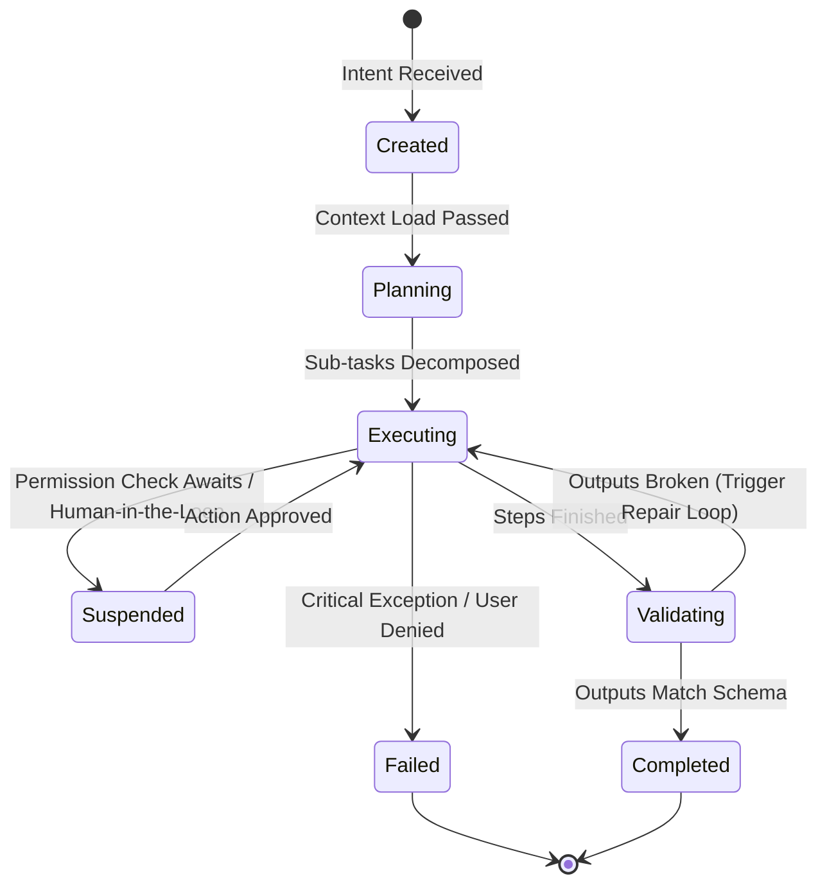

# U-AIX OS Agent State Machine & Lifecycle Specification

This document defines the execution states, transition hooks, exception managers, and self-repair cycles running inside the Layer 3 **Agent Runtime Engine**.

---

## 1. Agent State Machine Transitions



### State Transition Matrix

| Current State | Target State | Trigger Conditions | Actions Triggered |
|---|---|---|---|
| **Created** | `Planning` | Intent received, user identity verified | Load memory indices & system configuration settings |
| **Planning** | `Executing` | Sub-task DAG decomposition generated | Spawn worker nodes and load skill scripts |
| **Executing** | `Suspended` | Task requires human consent or web callback | Pause timer loops, prompt visual UI dialog overlays |
| **Suspended** | `Executing` | User approves action or callback completes | Resume runtime loop execution |
| **Executing** | `Validating` | All sub-task execution steps completed | Pipe outcomes to Validator Agent schema audit |
| **Validating** | `Executing` | Schema checks fail (Retries remaining) | Inject error prompt logs into self-repair script |
| **Validating** | `Completed` | Outcomes validated successfully | Save logs & vector summary to Memory Vault |
| **Any State** | `Failed` | Unhandled error, stack overflows, user abort | Halt loop, log failures, run recovery protocols |

---

## 2. Dynamic Execution Lifecycle Manager

Below is the standard JavaScript core coordinator loop running in Layer 3:

```javascript
class AgentLifecycleManager {
    constructor(agentId, permissions, maxRetries = 3) {
        this.agentId = agentId;
        this.permissions = permissions;
        this.maxRetries = maxRetries;
        this.retryCount = 0;
        this.state = 'Created';
        this.logs = [];
    }

    async executeWorkflow(intentPrompt, context) {
        this.log("Initializing context...");
        try {
            // 1. PLANNING PHASE
            this.state = 'Planning';
            const dagPlan = await this.plannerDecompose(intentPrompt, context);
            this.log(`Created DAG plan with ${dagPlan.steps.length} tasks.`);

            // 2. EXECUTION LOOP
            this.state = 'Executing';
            let executionOutput = {};

            for (const task of dagPlan.steps) {
                // Check if task needs human confirmation
                if (this.needsHumanAuthorization(task)) {
                    this.state = 'Suspended';
                    this.log(`Suspended: Awaiting human consent for [${task.name}]`);
                    const userApproved = await this.promptUserApproval(task);
                    if (!userApproved) {
                        throw new Error(`Execution aborted by user at task [${task.name}].`);
                    }
                    this.state = 'Executing';
                }

                // Run sandbox skill
                executionOutput[task.id] = await this.runSandboxSkill(task, context);
            }

            // 3. VALIDATION PHASE
            this.state = 'Validating';
            const validationResult = await this.validateSchema(executionOutput, dagPlan.constraints);
            
            if (!validationResult.valid) {
                if (this.retryCount < this.maxRetries) {
                    this.retryCount++;
                    this.log(`Validation failed: ${validationResult.reason}. Attempting self-repair loop (${this.retryCount}/${this.maxRetries})...`);
                    this.state = 'Executing';
                    return await this.repairAndRetry(intentPrompt, executionOutput, validationResult.reason, context);
                } else {
                    throw new Error("Validation failed and maximum retry threshold was reached.");
                }
            }

            // 4. COMPLETED PHASE
            this.state = 'Completed';
            await this.syncToVault(intentPrompt, executionOutput, context);
            return { status: "success", data: executionOutput };

        } catch (err) {
            this.state = 'Failed';
            this.log(`CRITICAL LIFE_CYCLE ERROR: ${err.message}`);
            await this.triggerRecovery(err);
            return { status: "failed", error: err.message };
        }
    }

    log(message) {
        const entry = `[${new Date().toISOString()}] [${this.state}] ${message}`;
        this.logs.push(entry);
        console.log(entry);
    }
}
```
